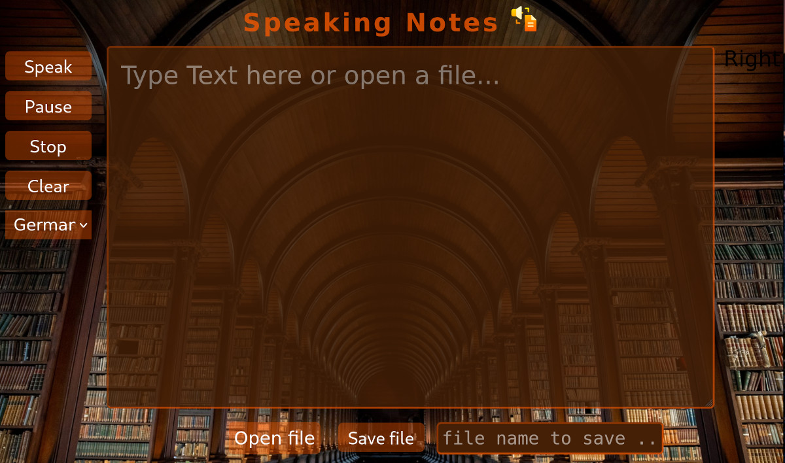

# Speaking Notes

### A lightweight and accessible notetaking-app which runs in a browser-window, uses large font-sizes and Text-To-Speech.

___

The project is for learning purpose only. It shows how "Text to Speech" functions can be implemented using the Web-Speech-APIThe various development steps are documented separately in the respective directories. Here you will also find information on sources and further information.. The aim is also to make the user interface accessible, especially for people with visual impairments.

The various development steps are documented separately in the respective directories. Here you will also find information on used sources and further information.

## Speek

The speek-function uses the [Web Speech Api](https://developer.mozilla.org/en-US/docs/Web/API/Web_Speech_API).
The Web Speech API enables you to incorporate voice data into web apps. The Web Speech API has two parts: 
- SpeechSynthesis (Text-to-Speech) and 
- SpeechRecognition (Asynchronous Speech Recognition)

The Speechsynthesis uses the voices, that the System supports.
Every `SpeechSynthesisVoice` has its own relative speech service including information about language, name and URI.
___
## Sources:

[MDN Web-Speech-Api](https://developer.mozilla.org/de/docs/Web/API/SpeechSynthesis)

[Stackoverflow](https://stackoverflow.com)

**Note:** The background-image is form 
[Trinity College Dublin](https://www.tcd.ie), just for private use.

___

