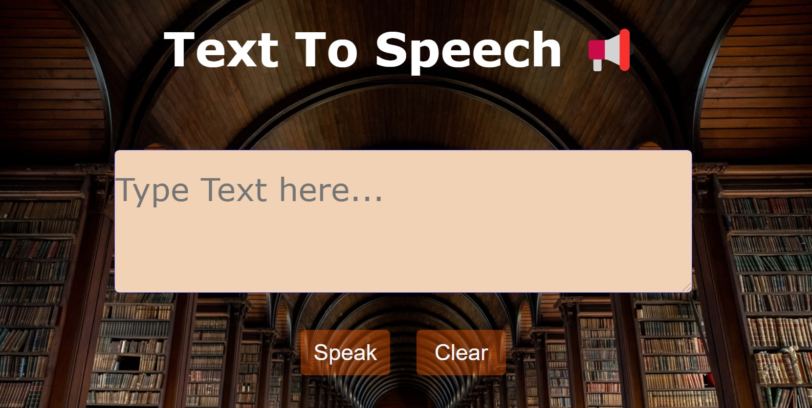

# Speeking Notes

The project is for learning purposes only. It shows how "Text to Speech" functions can be implemented. The aim is also to make the user interface accessible, especially for people with visual impairments.

___

**Note:** The background-image is form 
[Trinity College Dublin](https://www.tcd.ie), just for private use.